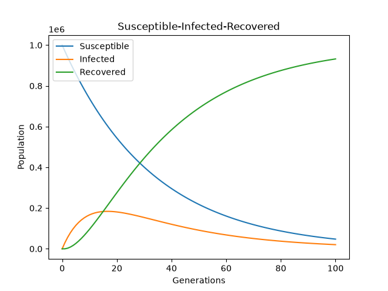

# Susceptible-Infected-Recovered Simulation

This program simulates infection spread in a population from given values

## Credits
https://en.wikipedia.org/wiki/Compartmental_models_(epidemiology)

## Dependencies

python 3.x

matplotlib

## How It Works

Each generation a number of the susceptible becomes infected determined by the `infection_rate` input

The program tracks the remainder of infections and recoveries in a remainder variable while displaying whole numbers, `if remainder >= 1`, `infected += 1` and `remainder -= 1`

## Inputs
```
Population: 1000000
Infected Start: 1
Infection Rate %: 3
Recovery Rate %: 10
Generations to run: 100
```

## Output (Simplified)
```
---------------
Generation: 0
Susceptible:  1000000
Infected:  1
Recovered: 0
Infected Remainder: 0
Recovered Remainder: 0
---------------

...

---------------
Generation: 100
Susceptible: 47537
Infected: 20363
Recovered: 932100
Infected Remainder: 0.6999999997708528
Recovered Remainder: 0.5188284182732787
---------------

```



## Known limitations / Assumptions

Simulation has a closed population without births or deaths

Assumes infection rate is between 0-100%

Assumes population is homogeneous 


## Planned Updates

Replace internal calculations with a genuine SIR infection equation


## Change Log

Added Recovered population

Added recovery calculations

Added decimal carry over for recoveries

Added `Susceptible`  and  `Recovered` to graph

Added Recovery rate input   

Generations now print from Generation 0, displaying the original population state

Renamed `healthy`to `susceptible`
